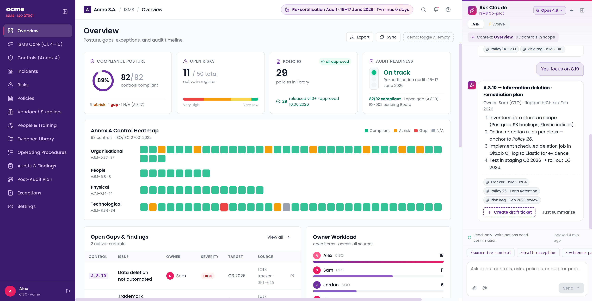

# annexa — a living, whitelabel IMS dashboard

A lightweight, self-hosted **ISO/IEC 27001:2022 + ISO 14001:2015 + ISO 9001:2015 compliance
dashboard** — a Sprinto/Vanta-style integrated management system (IMS) cockpit you can run
locally — built as a **self-evolving web app**: tell the built-in AI agent what to change and the
site restructures itself live, with every change git-committed and revertable in one click.

**Whitelabel in one step:** point it at a company website and it re-themes itself with that
company's colours, fonts, logo and name.

All data in this repo is **fictional demo data** for a made-up company ("Northwind Ltd").



## What's inside

| Page | What it shows |
|---|---|
| **Overview** | Control posture, risk heat, open nonconformities, the remediation programme and the audit calendar |
| **IMS Core** | Clauses 4–10 shared by all three standards, with the open nonconformity per clause |
| **Controls** | All 93 Annex A controls, with per-control implementation text, applicability and attached findings |
| **Statement of Applicability** | One tab per standard — the 27001 SoA, and how 9001 / 14001 record applicability |
| **Nonconformities** | Certification-audit findings and their corrective actions, with root causes |
| **Risk Register** | 5×5 matrix, inherent and residual scores, the acceptance model |
| **Sites & Offices** | Locations in scope and how each is operated |
| **Environment** | ISO 14001 — aspects registers, compliance obligations, objectives |
| **ESG** | Sustainability benchmark rating and science-based-targets track |
| **Incidents & Changes** | Incident and change registers, P1–P4 priority matrix, regulatory reporting flags |
| **Policies, Suppliers (posture + process), People & Training, Processes, Audit Programme, Evidence Library, Exceptions** | The supporting registers |
| **Settings → Branding** | Whitelabel the dashboard from a website (see below) |

Every page also carries **Home / Links / Notes** tabs:

- **Links** — the live working documents for that section (`data/links.json`, keyed by nav id), so
  the dashboard doubles as a link register.
- **Notes** — a running crib sheet per section (`data/notes.json`): what is here, what an auditor
  will probe, and the gaps with an answer ready. Blank-line separated blocks; an ALL-CAPS first
  line becomes a heading.

A page can declare extra tabs of its own in `site.json` (`"tabs": [{ "id", "label", "icon", "widget" }]`).

## Whitelabelling

Open **Settings**, enter the company's website and press **Scan website**. The server
(`branding.py`, standard library only) fetches the page and up to six of its stylesheets and
proposes:

- **Colours** — declared brand custom properties (`--primary`, `--brand`, `--accent`…) and
  `<meta name="theme-color">` weigh most, then colour frequency. An ink colour, muted text,
  surfaces and borders are derived from the accent hue, and text-on-accent is picked for contrast.
- **Fonts** — the most-used body and heading `font-family`, loaded from Google Fonts when available
  (Poppins is bundled as the fallback).
- **Logo, favicon and name** — logo-like ``s, touch icons, `og:image`, `og:site_name` / `<title>`.

Everything previews live across the whole app and every value can be edited before you press
**Apply**. Applying writes `site/theme.json` (colours, fonts, embedded logo and favicon) and the
names into `site.json` `brand{}`. Logos are embedded as `data:` URIs so the dashboard never keeps
hot-linking the company's site. **Reset to default** removes `theme.json`.

From the command line:

```bash
python branding.py https://www.example.com          # print the proposal
python branding.py https://www.example.com --write  # write site/theme.json
```

How it works: every brand colour in the UI is a CSS variable (`--brand-accent`, `--brand-accent-2`,
`--brand-accent-dark`, `--brand-ink`, `--brand-muted`, `--brand-surface`, `--brand-border`,
`--brand-on-accent`) defined in `colors_and_type.css`. `engine/theme.jsx` overrides them from
`theme.json` at boot, so widgets never hard-code a palette.

The scan only fetches public http(s) addresses. Hosts resolving to private, loopback or link-local
addresses are refused, including on redirects.

## Architecture: a living site

```
engine/            PROTECTED CORE — registry, primitives, loader, renderer, theme, AI panel
app.py, index.html PROTECTED — Flask server + boot page
branding.py        PROTECTED — website scan + theme writer
site/site.json     EVOLVABLE — brand, user, nav, page composition, drawers (the site spec)
site/theme.json    optional — whitelabel theme written by Settings → Branding
widgets/*.jsx      EVOLVABLE — self-registering components, discovered automatically
data/*.json        EVOLVABLE — all records; each key becomes a window global
schema/            site.json JSON Schema (used by /api/validate)
.claude/settings.json  hard deny-rules: the agent can never edit the protected core
```

- **No build step.** CDN React 18 + Babel-standalone; widgets are transpiled in the browser at
  boot. `GET /api/manifest` globs `site/`, `data/`, `widgets/` — drop a file in and it exists.
- **Crash-resilient.** Each widget loads in its own try/catch + ErrorBoundary; a broken widget
  renders an error card with a "Fix with AI" button, never a white screen.
- **Evolve mode.** The AI side panel has an Ask/Evolve toggle. In Evolve mode the agent gets
  Edit/Write inside the repo, the browser hot-reloads ~2s after any change, each turn is
  auto-committed (`evolve: …`), and the panel shows diff cards + a change-history drawer with
  one-click revert.
- **Structure = data.** Adding a page is a nav entry + a pages entry in `site/site.json` plus
  (optionally) a new widget file. Subtitles support `{expr}` templates evaluated against globals
  (e.g. `"{CONTROLS.length} controls"`).
- **AI context comes from the spec.** The chat and evolve prompts are built from `site.json`
  (`brand.legalName`, `user`, and an optional `aiContext` string or list of facts: standards,
  scope, certifier), so no organisation details live in code.

## Run

```bash
pip install -r requirements.txt   # flask + jsonschema
python app.py
# → http://127.0.0.1:8765
```

Optional environment variables (or a `.env` file in the *parent* directory, outside the served
folder — never commit keys):

| Var | Purpose |
|---|---|
| `PORT` | HTTP port (default 8765) |
| `MOODLE_URL` / `MOODLE_TOKEN` | Live training-completion stats from a Moodle instance |

The AI panel requires the `claude` CLI on your PATH; without it the rest of the dashboard works fine.

## Adapting it to your organisation

1. **Brand it** — Settings → Branding, or `python branding.py <url> --write`.
2. **Describe it** — set `brand`, `user`, `milestone` and `aiContext` in `site/site.json`.
3. **Load your registers** — replace `data/*.json` with your own records, keeping the same keys
   (SoA, NCs, findings, risks, suppliers, policies, sites…). Put your document links in
   `data/links.json` and your audit crib notes in `data/notes.json`.
4. Or just ask the Evolve agent to do any of it.

⚠️ Once `data/` holds real records it is confidential. Keep that copy private and do not push it to
a public fork.

## Changes in this release

- Three-standard IMS (27001 + 14001 + 9001) instead of a single-standard ISMS; multi-site.
- **Whitelabelling** — website scan, Settings → Branding page, `site/theme.json`, and every
  hard-coded brand colour replaced by `--brand-*` CSS variables.
- **Home / Links / Notes tabs** on every page, plus per-page custom tabs.
- **New pages:** Statement of Applicability (per standard), Nonconformities, Sites & Offices,
  Environment, ESG, supplier posture and process, training status (from an LMS export).
- AI prompts are generated from `site.json` rather than hard-coded.
- `page-controls.jsx` no longer hard-codes per-control content — it lives in `data/control-detail.json`.
- `CountdownChip` reads `SITE.milestone` instead of a date baked into the engine.
- Removed the Acme-specific `Post-audit roadmap` page; corrective actions live on Nonconformities.

## License

MIT (see LICENSE). Fonts: Poppins (SIL Open Font License).

## Disclaimer

This is a demo/reference implementation, not compliance advice. All names, companies, findings,
tickets and dates are fictional.
